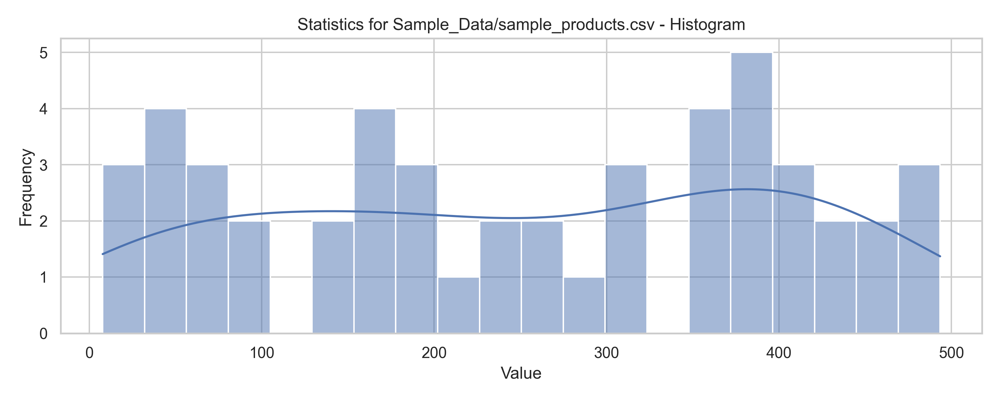
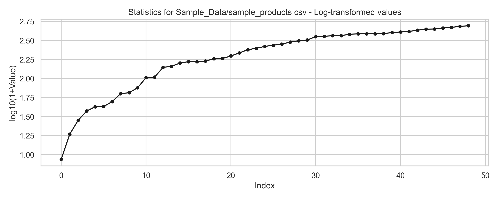
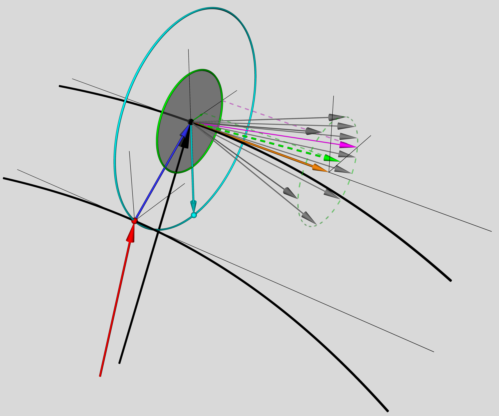

---
---
# **PORTFOLIO PYTHON SCRIPTS**
---
---
### OBJECTIVES: Most professional coding contributions are developed under non-disclosure agreements (NDAs) as part of proprietary products, which limits the ability to share them publicly. The purpose of this portfolio is to demonstrate coding skills using sample data that is entirely unrelated to previous employers or confidential projects.
---
---

<br>

<!-- TOC -->
# Table of Contents
- [A. Data Ingestion, Processing, and Visualization with PySpark and Pandas](#pyskarling)
	- [Key Features](##pysparkling_key-features)
	- [Code Structure] (##pysparkling_key-features)
- [B. Advanced 3D visualization with myavi](#mayavi)
	- [Key Features](##mayavi_key-features)
	- [Code Structure] (##mayavi_code-structure)
- [Why This is Portfolio-ready] (#portfolio-ready)
<!-- END TOC -->

<br><br>

---
---

<h1 id="pyskarling">A. Data Ingestion, Processing, and Visualization with PySpark and Pandas</h1>

---
Using: `portfolio_pysparkling.py`,
`Sample_Data/sample_data.json`, and
`Sample_Data/sample_products.csv`.

This project demonstrates **data ingestion, processing, and visualization** using a combination of **PySpark (via pysparkling)** and **Pandas**, complemented by **Matplotlib** and **Seaborn** for statistical visualization. It is designed as a **portfolio-ready example** for a Data Science or Data Engineering leadership roles.

--

<h2 id="pysparkling_key-features">Key Features</h2>

* **Flexible File Reading:** Handles both JSON and CSV formats.
* **Partition Management:** Dynamically repartitions data for testing and scalability.
* **Hybrid Processing:** Demonstrates Spark RDD operations alongside Pandas DataFrames.
* **Statistical Extraction:** Generates basic descriptive statistics from the ingested dataset.
* **Visualization:** Produces both histograms and log-transformed line plots.

--

<h2 id="pysparkling_code-structure">Code Structure</h2>


### 1. Imports

The script uses a standard stack:

* **Core Python:** `os`, `json`, `csv`, `datetime`, `re`, `io`
* **Data Science:** `numpy`, `pandas`
* **Distributed Processing:** `pysparkling`
* **Visualization:** `matplotlib`, `seaborn`

### 2. File Reading Function

```python
def read_file(fname=None, repartition=False, show_log=False):
    ...
```

* Defaults to reading a sample CSV or JSON file.
* Creates an RDD using `pysparkling.Context()`.
* Supports **CSV** and **JSON** ingestion.
* Optionally **repartitions** files based on file size (approx. 1 MB per partition).
* Returns a dictionary containing the RDD, Spark context, and metadata.

### 3. Main Execution Block

```python
if __name__ == "__main__":
    ...
```

* Reads file into an RDD.
* Extracts rows from selected partitions.
* Converts them into a Pandas DataFrame.
* Derives basic features (e.g., prices or contact counts).

### 4. Feature Extraction

* For JSON: Extracts `price` fields from nested product dictionaries.
* For CSV: Extracts numerical features (e.g., `price`).
* Cleans data (replaces empty values, fills NaNs, type casting).

### 5. Visualization

The script produces two plots:

* **Histogram with KDE (Seaborn):** Distribution of raw values.
* **Log-transformed Line Plot (Matplotlib):** Captures heavy-tail characteristics of the data.

Example plotting function:

```python3
def plot_statistics(series: pd.Series, title: str = "Data Distribution") -> None:
    sns.set(style="whitegrid")
    fig1, ax1 = plt.subplots(figsize=(10, 4))
    sns.histplot(series, bins=20, kde=True, ax=ax1)
    ax1.set_title(f"{title} - Histogram")
    fig1.tight_layout()
    plt.show(block=False)

    fig2, ax2 = plt.subplots(figsize=(10, 4))
    ax2.plot(np.log10(1 + series.values), "ko-", markersize=4)
    ax2.set_title(f"{title} - Log-transformed values")
    fig2.tight_layout()
    plt.show(block=True)
```
The resulting images from a sampe data are the following.


### 6. Example Workflow

a. **Run the script:**

   ```bash
   python3 portfolio_pysparkling.py
   ```

b. **Select a file type:** The script auto-detects `.csv` or `.json`.

c. **Inspect DataFrame:**

   ```python3
   print(df.head())
   print(df.describe())
   ```

d. **Generate Visualizations:** Histograms and log-scale plots provide statistical insight.

### 7. Next Steps (Possible Extensions)

* Automate **unit tests** for ingestion and transformation functions.

<br><br>

---
---

<h1 id="mayavi">Advanced 3D visualization with mayavi</h1>

---

Using: `portfolio_mayavi.py`.

This script generates high-resolution 3D scientific visualizations of particle dynamics, gyrointegrals, and magnetic field geometry using Mayavi.
It provides publication-quality figures for research, focusing on the gyrointegrated kinetic theory, a novel framework distinct from traditional gyrokinetics in plasma physics.

--

<h2 id="mayavi_key-features">Key Features</h2>

* **Publication-ready 3D visuals:** export high-resolution figures for papers.
* **Modular plotting functions:** separate routines for particles, gyrointegrals, magnetic fields, and gyrocenters.
* **Reproducible configuration:** consistent color palette, resolution, and output directory.
* **Research-focused:** demonstrates gyrointegral theory with explanatory visuals.
* **Portfolio-ready code:** clear structure with logging, parameter control, and figure saving.

--

<h2 id="mayavi_code-structure">Code Structure</h2>

### 1. Configuration

* Logging setup for reproducibility.
* Output directory and filename prefix.
* Visualization parameters: figure size, background, colors, resolution.

### 2. Utility Functions

* `generate_demo_vectors` → creates synthetic particle velocity vectors.
* Plotting routines:
	* Particles:
		* `plot_particle_vectors` → multiple particles
		* `plot_selected_particle_vectors` → highlight one particle
		* `plot_selected_particle_vectors_projection` → projection on plane
	* Magnetic field:
		* `plot_magnetic_field` → straight and curved field lines
	* Gyrointegrals:
		* `plot_gyrointegral_circles` → circular orbits
		* `plot_gyrointegrated_vectors` → mean velocity vector
		* `plot_vparallel_vector` → parallel velocity component
		* `plot_disk_perpvect_points` → perpendicular disk visualization
	* Gyrocenter:
		* `plot_gyrocenter_features` → instantaneous gyrocenter position, radius, and orbit

### 3. Main Execution

* Generate demo vectors.
* Compute gyrointegrated mean velocity (`ugi`, `vgi`, `wgi`).
* Create Mayavi figure with background and scaling.
* Sequentially call plotting functions for:
	* Particles, gyrointegrals, fields, and gyrocenter.
* Adjust view (mlab.view, mlab.draw).
* Save figure in timestamped directory.
* Clean up figure (mlab.clf) for reuse.

The resulting image is the following.<br>

<br>

<br><br>

---
---


<h1 id="portfolio-ready">Why This is Portfolio-ready</h1>

---
* **Demonstrates leadership-level breadth:** Shows integration of Spark-like distributed computing with Python data science workflows.
* **Clarity & Modularity:** Many functions make the code reusable and extensible.
* **Real-world Relevance:** Handling multiple file types such as JSON and CSV mirrors common industry pipelines.
* **Visualization Focus:** Highlights ability to not just process, but also communicate data insights.

<br><br>

---
---

<br><br>
Author: izacard<br>Github: <a href="https://www.github.com/izacard/portfolio">https://www.github.com/izacard/portfolio</a>
<br><br>


